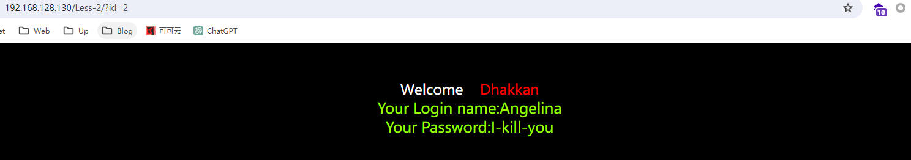
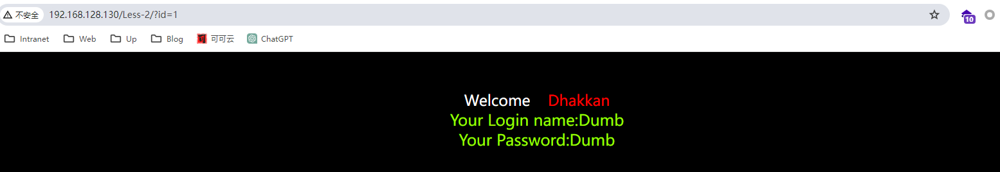
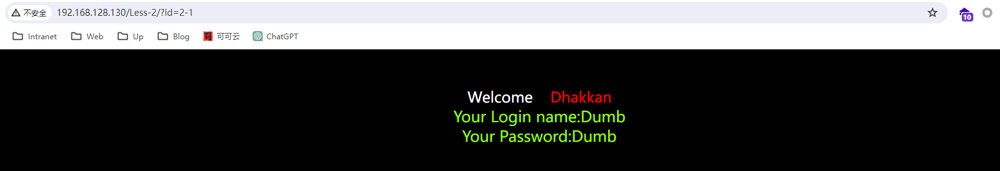
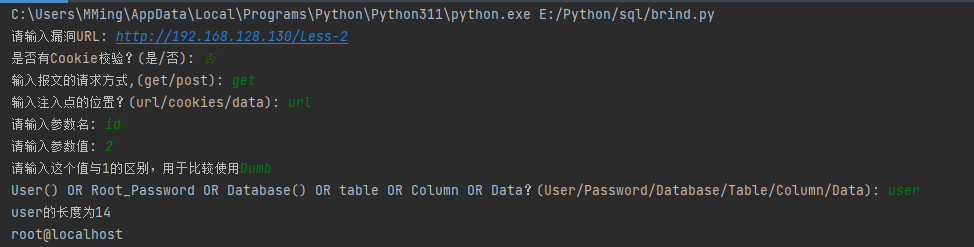
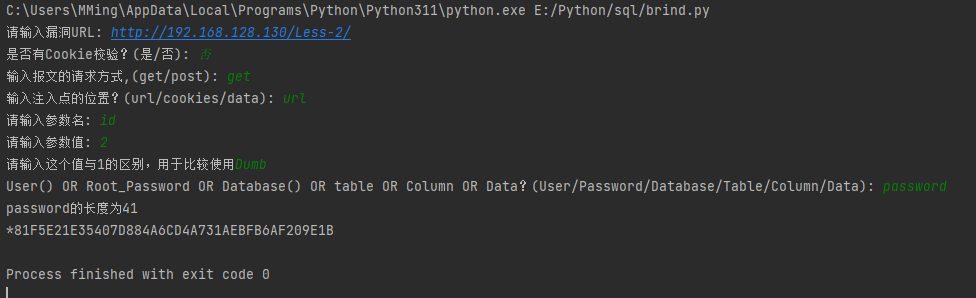
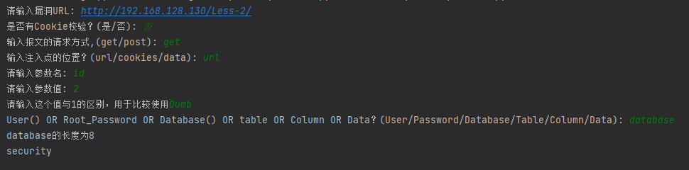
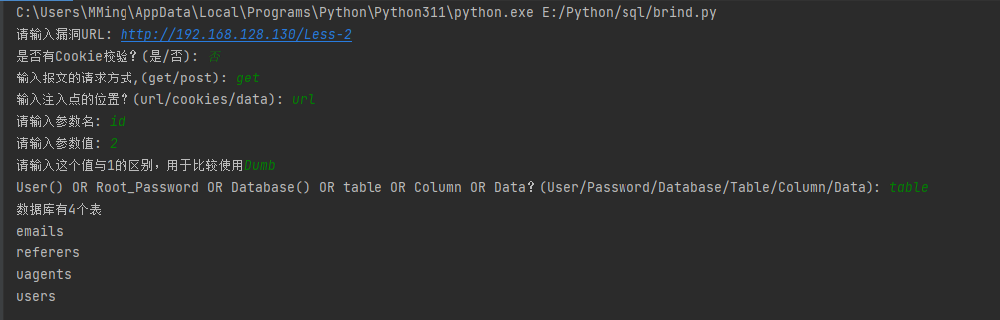
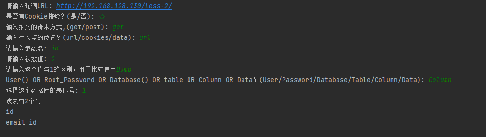
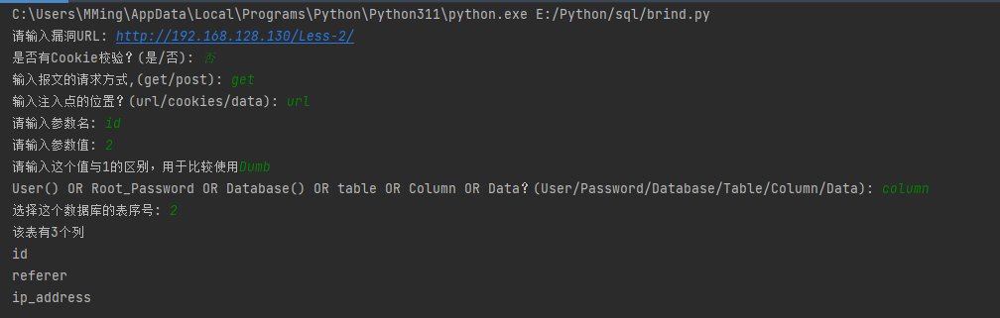
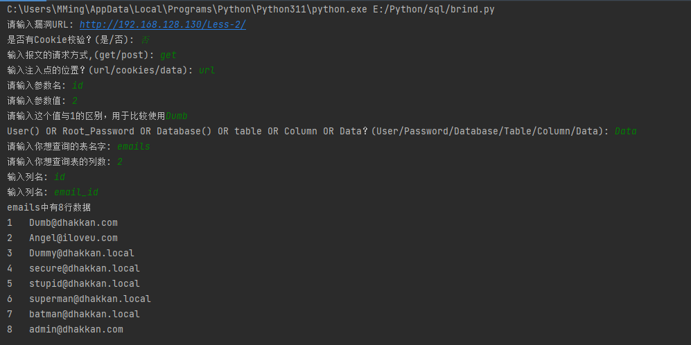

# Injection-information-extraction-tool


## 0x01摘要

这是一个通过整数型注入获取数据库信息的脚本(支持盲注)，支持get/post请求方式，可以携带cookie/身份信息，适用于url/data/cookie注入，它可以获取user()，database()，root密码的hash值，以及当前数据库中的表信息，可以bypass魔术引号的过滤(addslashes)。

## 0x02使用方式(举例[sqllabs](https://github.com/Audi-1/sqli-labs))

发现了一个整数型注入点







收集信息：

漏洞URL为http://192.168.128.130/Less-2
请求方式是get，注入点位置在url中，参数名为id，然后找返回包的不同点，我在这里举例为id=2以及id=1的返回包信息，相对于id=2的返回包，id=1的返回包回显了Dumb这个字符串。

依据脚本提示输入参数就可以获取数据库信息了

执行结果如下

```sql
select user();
```



```sql
select authentication_string from mysql.user where user='root';
```



```sql
select database();
```



```sql
SELECT table_name FROM information_schema.tables WHERE table_schema = database()
```



```sql
select column_name FROM information_schema.columns WHERE table_name = (select table_name FROM information_schema.tables WHERE table_schema = database() limit 0,1)
```



```sql
select column_name FROM information_schema.columns WHERE table_name = (select table_name FROM information_schema.tables WHERE table_schema = database() limit 1,1)
```



```sql
select id,email_id from emails
```



## 免责声明

本工具仅用于合法的授权安全测试和教育目的。未经授权访问或测试未授权的系统是非法的，会产生法律责任。 

本工具的作者概不负责任何非法或未经授权使用此工具所产生的后果。使用者承担使用本工具的全部责任。 
